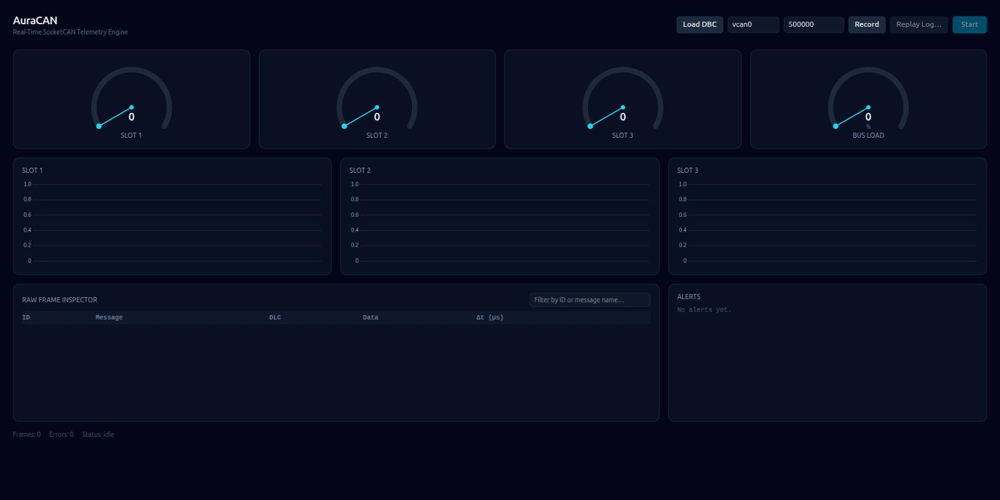

# AuraCAN

Real-time SocketCAN telemetry engine. Rust/Tauri backend reads raw CAN
frames from a Linux SocketCAN interface, decodes them against a `.dbc`
signal database, and streams telemetry to a React/TypeScript dashboard.

## Features

- Live SocketCAN streaming with automatic reconnect (exponential backoff,
  5 attempts) if the interface drops, and interface auto-discovery
  (`/sys/class/net`) instead of requiring the name typed from memory.
- DBC-driven decoding: standard `BO_`/`SG_` messages, multiplexed signals
  (`M`/`m<N>`), `VAL_` enum tables, and `CM_` comments (see
  [DBC support](#dbc-support) below for the exact subset).
- User-configurable dashboard: 1-6 gauge/chart slots, each bound to any
  decoded signal, with gauge range/warn/danger derived from the signal's
  DBC `[min|max]`. Layout, interface, baud rate, and DBC path persist
  across restarts.
- Threshold alerts: a running log of every signal crossing into/out of
  warning or danger, with a beep + desktop notification on danger.
- Recording & replay: capture raw frames to a `candump -l`-compatible
  log (inspectable/replayable with standard `can-utils` too), and replay
  one back through the identical decode/UI pipeline at recorded (or
  scaled) speed — useful for offline debugging without live hardware.
- Raw frame inspector with a live filter by hex/decimal ID or message
  name.

## Layout

- `src-tauri/src/can/` — `CanFrame`, bit-level signal extraction, and the
  `.dbc` parser (`DbcDatabase`, `SignalDecoder`).
- `src-tauri/src/listener/` — async, non-blocking SocketCAN reader
  (`socketcan` crate, tokio) with reconnect-on-drop, a rolling bus-load
  monitor, a `candump -l`-format log reader/writer (`candump`), and a file
  replay driver (`replay`) that feeds a recorded log through the same
  pipeline as a live socket.
- `src-tauri/src/state/` — shared telemetry store (`TelemetryStore`).
- `src-tauri/src/commands/` — Tauri commands (`load_dbc`, `start_can_stream`,
  `start_replay`, `start_recording`/`stop_recording`, `stop_can_stream`,
  `list_can_interfaces`) that wire the listener → decoder → store → 60Hz UI
  event emitter (`telemetry-update`, `can-frame`, `stream-status`).
- `src/` — React dashboard: user-configurable gauge/chart slots (1-6, any
  DBC signal), bus-load gauge, a raw frame inspector table, and a
  threshold alert log (sound + desktop notification on entering danger).
  Interface/baud/DBC path/slot layout persist to `localStorage`.
- `scripts/can_simulator.py` — broadcasts simulated `MotorStatus` frames on
  a virtual CAN interface for local testing.
- `scripts/motor.dbc` — sample DBC matching the simulator's frame layout.

## DBC support

`DbcDatabase::parse` (`src-tauri/src/can/dbc.rs`) implements a practical
subset of the DBC grammar, not the full spec. Supported:

- `BO_`/`SG_` message and signal definitions: bit position/length,
  byte order (`@0` big-endian/Motorola, `@1` little-endian/Intel), sign,
  factor/offset, `[min|max]`, and unit string.
- Multiplexed signals: a selector signal marked `M` and dependent signals
  marked `m<N>`; only the signals matching the current frame's selector
  value are decoded and emitted (see `decodes_only_the_active_multiplexed_signal`
  in `dbc.rs`'s tests). Extended multiplexing (multiple selectors, mux
  value ranges) is not supported.
- `VAL_` enum tables, attached per-signal as `value_table` and shown in
  place of the raw number when a gauge's current value matches an entry.
- `CM_ BO_`/`CM_ SG_` comments, surfaced as tooltips/descriptions.

Not supported (parsed lines are ignored, not errored on): `BA_`/`BA_DEF_`
attributes (e.g. cycle time, non-`VAL_` defaults), `BO_TX_BU_`,
`EV_`/environment variables, `SG_MUL_VAL_` (extended multiplexing), and
`SIG_GROUP_`. A `.dbc` using only those won't fail to load — those
signals just won't decode.

## Prerequisites (Linux)

Tauri's webview needs GTK/WebKit dev headers to build:

```bash
sudo apt-get install -y libwebkit2gtk-4.1-dev libgtk-3-dev librsvg2-dev \
    libsoup-3.0-dev build-essential curl wget file
```

Rust (via rustup) and Node.js are also required.

> Note: this repo's `package.json` currently pulls in Vite 7, which wants
> Node >= 20.19. On Node 18, `npm install` succeeds but `vite build`/`vite
> dev` fail (`@tailwindcss/oxide`'s native binding won't load — Node 18 is
> below its own `>= 20` engine requirement too). If you can't upgrade your
> system Node, installing a standalone Node 20+ into a local directory and
> prepending it to `PATH` for this project works without touching the
> system install or needing root:
> ```bash
> mkdir -p ~/.local/node20
> curl -L https://nodejs.org/dist/v20.19.0/node-v20.19.0-linux-x64.tar.xz \
>   | tar -xJ -C ~/.local/node20 --strip-components=1
> export PATH="$HOME/.local/node20/bin:$PATH"
> rm -rf node_modules package-lock.json && npm install
> ```

## Virtual CAN setup (for local testing without real hardware)

```bash
sudo modprobe vcan
sudo ip link add dev vcan0 type vcan
sudo ip link set up vcan0
```

## Running

```bash
npm install
npm run tauri dev
```

In a separate terminal, stream simulated frames:

```bash
cd scripts
python3 -m venv .venv && ./.venv/bin/pip install python-can
./.venv/bin/python can_simulator.py --interface vcan0
```

In the app, load `scripts/motor.dbc` (via "Load DBC"), pick an interface
(autocompletes from detected SocketCAN interfaces, or type one — e.g.
`vcan0`), then hit Start. Assign signals to gauge/chart slots with the
dropdowns above them; add/remove slots with "+ Add slot" / "×".

- **Record**: while stopped, click "Record" to pick a `.log` file; every
  frame seen afterward (live or replayed) is appended to it until you
  click it again to stop. Independent of Start/Stop — recording keeps
  running across stream restarts.
- **Replay**: "Replay Log…" picks a previously recorded `.log` and feeds
  it through the same pipeline as a live stream, paced by its original
  timestamps.

## Testing

Rust:

```bash
cd src-tauri
cargo test
```

Covers DBC parsing (incl. multiplexed signals, `VAL_` tables, `CM_`
comments), bit extraction/sign-extension, the candump-format log
reader/writer, replay pacing/cancellation, the bus-load monitor, and the
telemetry store. The Tauri command layer (`src-tauri/src/commands/`) is
thin wiring over these and isn't separately unit-tested.

Frontend (Vitest + React Testing Library, needs Node >= 20 — see the
Prerequisites note above):

```bash
npm test          # run once
npm run test:watch
```

Covers the pure logic in `src/lib/` (alert-level classification, DBC
signal flattening, hex/byte formatting, settings persistence incl.
malformed-storage fallback) and a couple of component render checks
(`Gauge`, `AlertLog`). Not yet covered: `App.tsx` itself (would need
mocking `@tauri-apps/api`'s `invoke`/`listen`, which only work inside a
real Tauri webview) and `Chart`/`FrameLog`.

## Platform

Linux only: the `socketcan` dependency is gated to
`cfg(target_os = "linux")`, and the app is built/tested against Linux's
SocketCAN stack. `cargo check`/`build` on macOS or Windows will fail to
resolve that dependency by design, not by omission.

## Screenshots



Captured from `npm run dev` in a browser (idle state, no DBC loaded
yet), not a native Tauri window — this environment still can't complete
a full `npm run tauri dev`/`cargo tauri build` (GTK/WebKit headers
aren't installed and there's no `sudo` here to add them; see
[Prerequisites](#prerequisites-linux)). The web UI and native window
render the same React app, but a real screenshot showing live gauges,
alerts, and the frame inspector populated would still be a welcome
addition once someone runs it against real or simulated traffic.
